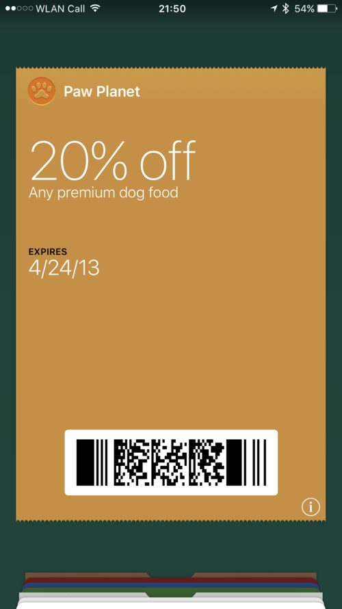
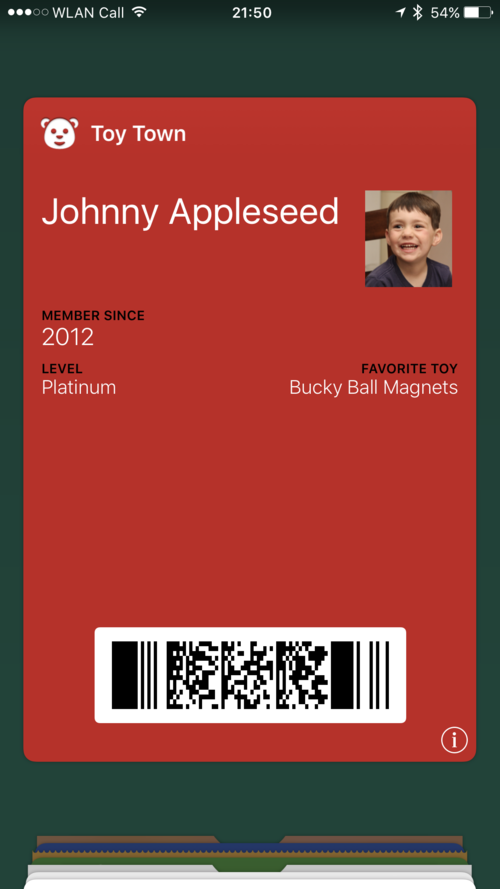

According to the [Online Etymology Dictionary](http://etymonline.com/index.php?term=business), the first attested use of "business card" dates back to 1840, a time when a paper representation of one’s contact details was the only possibility.

Business cards serve to facilitate the transfer of contact information. A conventional business card could contain, among other things, one’s name, email, website, phone number, and some assortment of social networks.

Today, almost 200 years since the first business cards, a frozen-in-time "snapshot" of personal information becomes immediately outdated as soon as it is printed. An _ideal_ business card solution would live digitally in the cloud or on my phone, be easily shareable, and update itself when a person changes their contact details.

The Apple Wallet app (formerly Passbook) comes preinstalled since iOS 6. It’s designed to contain wallet-related tickets or cards, such as boarding passes, transit tickets, coupons, concert tickets, and, more recently, payment cards. These records can be updated remotely from a controlling server, such as when a ticket’s time changes, a gift card’s balance changes, or a boarding pass’s gate is announced.

Because the functionality to update was a requirement for my self-refreshing business cards, I thought to piggyback on Apple’s work to create a record in Wallet (or "pass" as they are called) that looked and behaved like a business card. In the same way that an airline can push a gate-change update to my phone, I can push a change of information (such as a new phone number) to people’s devices through the Apple Push Notification Service (APNS) which directs these devices to query the server for updates. An update is downloaded if found, and a visual indication of this update can be optionally displayed: "Your flight will depart from gate 65."

Note that passes don’t need to be "dynamic", or server-updatable. A pass representing a coupon, for example, might be "static". Though because it conveys an offer applicable under certain conditions, it could benefit from an update when the offer is no longer valid. The difference at a technical level is the presence of a key-value pair in the pass’s JSON payload that direct a device to register itself as an update recipient. The value of this pair is a URL to which the device appends certain endpoints, as specified by the [PassKit Web Service](https://developer.apple.com/library/content/documentation/PassKit/Reference/PassKit_WebService/WebService.html) reference.

When I started this project years ago, I concentrated my efforts to write a web service implementation on [Parse](https://github.com/a2/passcards-parse), which bundles a MongoDB instance, push notification support (via APNS or the-Google-equivalent-of-APNS), and cloud functions (custom JavaScript that runs on Parse’s servers). The best part was that, for my use case, these services were for free for my use case. When Parse [announced](http://blog.parse.com/announcements/moving-on/) it would shut down in early 2017, I wanted to write a new implementation in Swift to handle the pass client registration and the sending of push notifications.

## Just what _is_ a Pass, anyway?

A pass is a ZIP archive containing the following files:

* **_pass.json_** The pass payload in JSON format. More information about its structure can be found in the [PassKit Package Format Reference](https://developer.apple.com/library/content/documentation/UserExperience/Reference/PassKit_Bundle/Chapters/Introduction.html).
* **_manifest.json_** A JSON object keyed by file path (relative to bundle root) and whose values are SHA-1 digest hashes of those files. All files must be listed, except _manifest.json_ and _signature_.
* **_signature_** A detached PKCS#7 signature of manifest.json, signed with your Pass Type ID certificate.
* **Optional images** such as _background.png_, _footer.png_, _icon.png_, _logo.png_, _strip.png_, _thumbnail.png_. The images supported by a pass is dependent on the pass’s type.
* **Localized resources** organized into _\*.lproj_ directories, not unlike in Apple platform apps.

The _manifest.json_ file contains cryptographic digest "fingerprints" of every file in the pass, and the _signature_ file is a cryptographic signature that verifies the pass’s authenticity. The _signature_ is "detached" in that it itself does not contain the signed data. The abbreviation _PKCS_ stands for _Public Key Cryptography Standards_ (hopefully self-explanatory) developed by RSA Security Inc. The signing algorithm uses the seventh such standard and is formally defined by [RFC 2315](https://tools.ietf.org/html/rfc2315) (_Cryptographic Message Syntax_).

Generating this file is handled by the Apple’s _signpass_ sample code. You can download the Wallet Support Materials [here](https://developer.apple.com/services-account/download?path=/iOS/Wallet_Support_Materials/WalletCompanionFiles.zip), which also include example passes and sample Ruby code for signing and serving passes.

## Picking a Pass Style

A pass’s style is specified by the presence of exactly one of the following keys: _boardingPass_, _coupon_, _eventTicket_, _generic_, and _storeCard_.

<table>
  <tr style="display: flex">
    <td style="flex: 1"></td>
    <td style="flex: 1"></td>
    <td style="flex: 1"></td>
    <td style="flex: 1"></td>
    <td style="flex: 1"></td>
  </tr>
  <tr style="display: flex">
    <td style="flex: 1"><i>boardingPass</i></td>
    <td style="flex: 1"><i>coupon</i></td>
    <td style="flex: 1"><i>generic</i></td>
    <td style="flex: 1"><i>eventTicket</i></td>
    <td style="flex: 1"><i>storeCard</i></td>
  </tr>
</table>

For a business card, the _boardingPass_ and _eventTicket_ styles do not make so much sense, but can be useful for other occasions. The _storeCard_ and _coupon_ styles are very similar, with the _coupon_ style having a slight ripped border along the top but have otherwise the same features. A _strip.png_ image can provide a background, as seen in the "Organic Produce" _storeCard_ example. The _generic_ type is the only one that supports the thumbnail.png image, which makes it great for a photo of the person's face, though the _storeCard_'s _strip.png_ can provide a image, albeit longer.

## Making My Pass

My pass's JSON payload, with added comments and keys reordered and grouped for clarity:

```json
{
  // must be 1
  "formatVersion": 1,

  // required for "dynamic" passes
  "authenticationToken": "<secret>",
  "serialNumber": "<secret>",
  "webServiceURL": "https://pass.a2.io/",

  // top-left "logo" text
  "logoText": "Alexsander Akers",

  // barcode data, handy for scanning with the Wallet app
  "barcode": {
    // PDF417 is a cool format but you can use QR or Aztec
    "format": "PKBarcodeFormatPDF417",
    "message": "https://pass.a2.io/abc123.pkpass",
    "messageEncoding": "iso-8859-1"
  },

  // optional metadata
  "description": "Alexsander Akers",
  "organizationName": "Alexsander Akers",

  // style colors as rgb strings
  "backgroundColor": "rgb(0, 168, 143)", // #00a88f
  "foregroundColor": "rgb(255, 255, 255)", // white
  "labelColor": "rgb(255, 255, 255)", // white

  // style key
  "storeCard": {
    // secondary fields are below the strip image
    "secondaryFields": [
      { "key": "email", "label": "Email", "value": "me@a2.io" },
      { "key": "twitter", "label": "Twitter", "value": "@a2" }
    ],
    // back fields, interface revealed with (i) button
    "backFields": [
      { "key": "email-back", "label": "Email", "value": "me@a2.io" },
      { "key": "facebook", "label": "Facebook", "value": "fb.com/a2" },
      { "key": "github", "label": "GitHub", "value": "github.com/a2" },
      { "key": "website", "label": "Website", "value": "a2.io" }
    ]
  },

  // signing data
  "passTypeIdentifier": "<secret>",
  "teamIdentifier": "<secret>"
}
```

For each field (whether in _primaryFields_, _secondaryFields_, _auxiliaryFields_, _headerFields_ or _backFields_), the _key_ key is required and must be unique in the pass. A _value_ is also required, but can be localized (translated) through a locale-specific _Localizable.strings_ file in an _\*.lproj_ subdirectory (e.g. _en_US.lproj_ for American English).

For example, you can override a value with "Hello, world!" in the English _Localizable.strings_ file and "Hallo, Welt!" in the German _Localizable.strings_ file, and so on. Number formatting is available through optional _numberStyle_ and _currencyCode_, and date formatting through the _dateStyle_, _ignoresTimeZone_, _isRelative_, and _timeStyle_ keys. More information about that can be found on the [Field Dictionary Keys](https://developer.apple.com/library/content/documentation/UserExperience/Reference/PassKit_Bundle/Chapters/FieldDictionary.html#//apple_ref/doc/uid/TP40012026-CH4-SW1) page.

After the payload is written, we get to the images. I included _icon.png_, _logo.png_, and _strip.png_ images in three sizes. That is, _icon.png_ as well as _icon@2x.png_ and _icon@3x.png_; the same applies for _logo.png_ and _strip.png_.

## Uploading to Passcards

Once you've done that, it's time to sign the pass, using the _signpass_ utility from Apple (unless you're feeling adventurous). Note that you can double click the resulting _\*.pkass_ file on your Mac for a preview, although the UI is relatively outdated. Then you can upload the pass to Passcards with [this cURL command](https://github.com/a2/passcards-swift#uploading-a-pass) et voilà!
